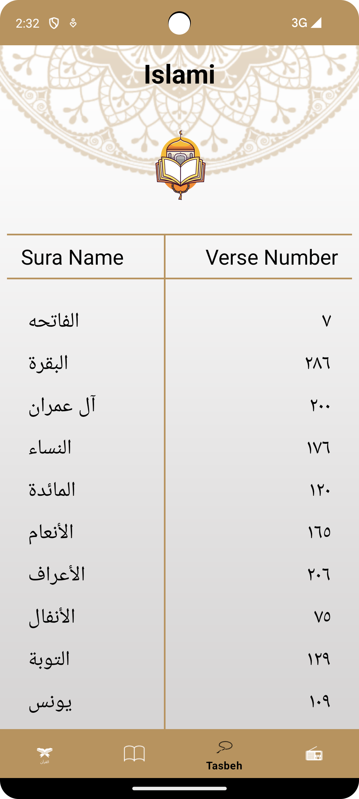
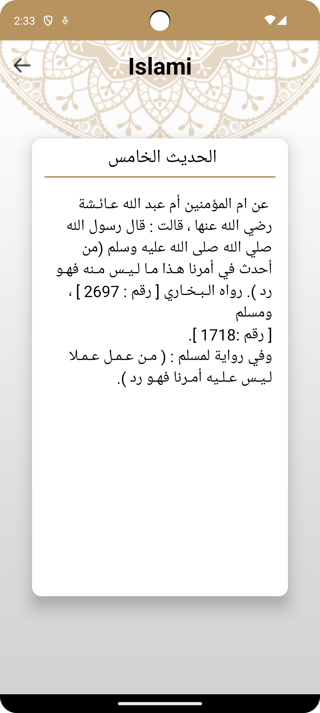
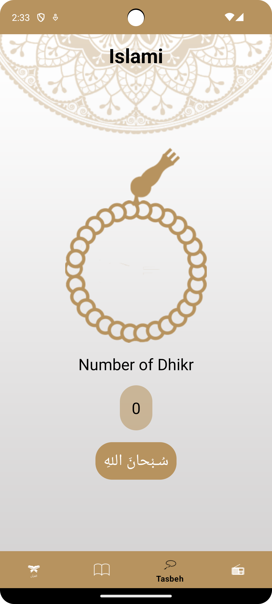
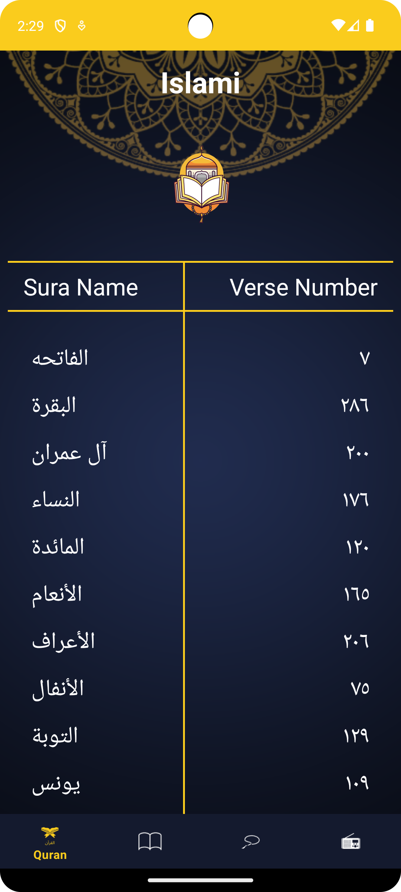
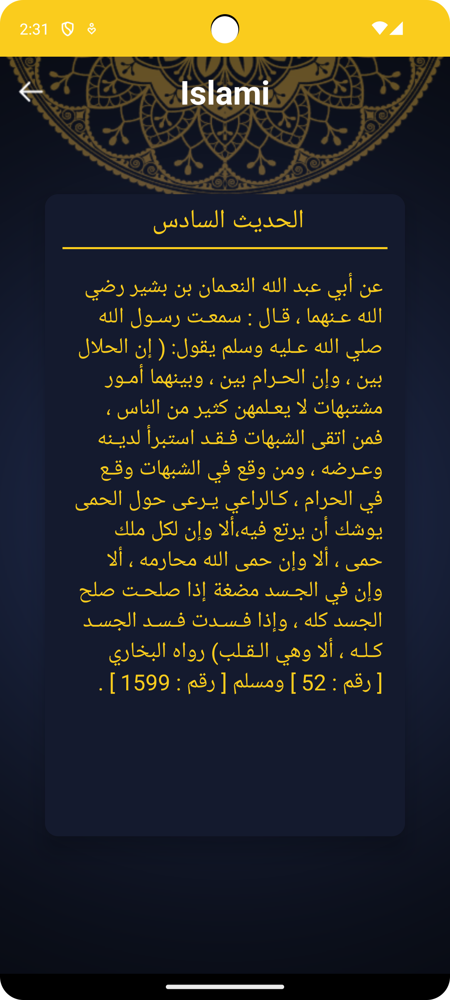
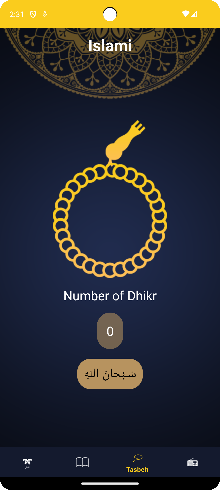

# Islamic App

## Overview

The Islamic App, built with Kotlin, is a comprehensive tool for Muslims, providing access to various religious resources and features in one platform. With a focus on simplicity and usability, the app offers Quranic verses, Hadith collections, Tasbih counters, and a radio feature to listen to the Quran recitations.

## Features

- **Quranic Verses:** Browse and read verses from the Holy Quran.
- **Hadith Collections:** Access authentic Hadith collections.
- **Tasbih Counter:** Use the built-in Tasbih counter to keep track of your daily dhikr and supplications.
- **Quran Radio:** Listen to live radio broadcasts of Quran recitations from renowned Qaris around the world.

## Technology Stack

- **Programming Language:** Kotlin
- **Backend Services:** APIs for radio streams.
- **Database:**  local data storage.
- **Development Tools:** Android Studio.

## Future Enhancements

- Integration of additional features such as prayer timings, Qibla direction finder, and Islamic calendar.
- Incorporation of user feedback and community contributions to improve app functionality and content.
- Integration with social media platforms for sharing Quranic verses and Hadith quotes.

## Screenshots

| Screenshot 1 | Screenshot 2 | Screenshot 3 |
|---------------|---------------|---------------|
|  |  |  | 

| Screenshot 1 | Screenshot 2 | Screenshot 3 |
|---------------|---------------|---------------|
|  |  |  | 

3. Build and run the app on an Android device or emulator.

## Contributions

Contributions are welcome! Please feel free to submit issues or pull requests.
